Adubação com K - Algodão
================
Jorge Alonso
2025-01-31

# 1. Preparando para as análises

## 1.1. Carregando os pacotes e dados

``` r
# Carregando os pacotes
library(openxlsx)
library(tidyverse)
library(bestNormalize)
library(easyanova)
library(cowplot)
library(ggcorrplot)
library(psych)
library(factoextra)
```

``` r
# Limpeza do histórico e da memória
rm(list=ls(all=TRUE)) # Remove dados carregados anteriormente
gc() # Limpa a memória
```

    ##           used  (Mb) gc trigger  (Mb) max used  (Mb)
    ## Ncells 2353443 125.7    4304661 229.9  4304661 229.9
    ## Vcells 3950595  30.2    8388608  64.0  6023545  46.0

``` r
# URL do repositório onde estão os dados
raw_url <- "https://raw.githubusercontent.com/jmalonso55/polihalita/refs/heads/main/dados_algod%C3%A3o.csv"

# Carregando os dados
data <- read.csv(raw_url, sep = ",")

# Verificando
summary(data)
```

    ##      Treat         prod               time               Block     
    ##  Min.   :1.0   Length:24          Length:24          Min.   :1.00  
    ##  1st Qu.:2.0   Class :character   Class :character   1st Qu.:1.75  
    ##  Median :3.5   Mode  :character   Mode  :character   Median :2.50  
    ##  Mean   :3.5                                         Mean   :2.50  
    ##  3rd Qu.:5.0                                         3rd Qu.:3.25  
    ##  Max.   :6.0                                         Max.   :4.00  
    ##    fiber_kgha     seed_kgha         Mic             Pol             Len       
    ##  Min.   :1074   Min.   :1207   Min.   :4.140   Min.   :1.110   Min.   :28.20  
    ##  1st Qu.:1571   1st Qu.:1776   1st Qu.:4.322   1st Qu.:1.181   1st Qu.:30.06  
    ##  Median :1718   Median :1981   Median :4.490   Median :1.201   Median :30.48  
    ##  Mean   :1693   Mean   :1962   Mean   :4.486   Mean   :1.201   Mean   :30.49  
    ##  3rd Qu.:1860   3rd Qu.:2162   3rd Qu.:4.680   3rd Qu.:1.230   3rd Qu.:31.25  
    ##  Max.   :2245   Max.   :2737   Max.   :4.790   Max.   :1.250   Max.   :31.82  
    ##       Str             Unf             Elg              Rd       
    ##  Min.   :25.40   Min.   :81.10   Min.   :5.300   Min.   :78.10  
    ##  1st Qu.:27.25   1st Qu.:83.08   1st Qu.:5.500   1st Qu.:80.85  
    ##  Median :27.85   Median :83.95   Median :5.700   Median :81.60  
    ##  Mean   :28.12   Mean   :83.79   Mean   :5.683   Mean   :81.57  
    ##  3rd Qu.:28.65   3rd Qu.:84.72   3rd Qu.:5.825   3rd Qu.:82.38  
    ##  Max.   :31.00   Max.   :86.10   Max.   :6.000   Max.   :84.10  
    ##      mais_b           SFI             Mat              SCI       
    ##  Min.   :5.700   Min.   :4.000   Min.   :0.8600   Min.   :124.0  
    ##  1st Qu.:6.800   1st Qu.:5.125   1st Qu.:0.8700   1st Qu.:130.5  
    ##  Median :7.150   Median :6.000   Median :0.8704   Median :136.5  
    ##  Mean   :7.067   Mean   :5.963   Mean   :0.8700   Mean   :136.9  
    ##  3rd Qu.:7.400   3rd Qu.:6.900   3rd Qu.:0.8730   3rd Qu.:142.0  
    ##  Max.   :8.000   Max.   :8.200   Max.   :0.8800   Max.   :155.0  
    ##       CSP             N               K               P               Ca       
    ##  Min.   :2244   Min.   :34.30   Min.   : 9.70   Min.   :1.500   Min.   :29.20  
    ##  1st Qu.:2307   1st Qu.:42.52   1st Qu.:15.70   1st Qu.:4.000   1st Qu.:30.45  
    ##  Median :2334   Median :44.10   Median :17.70   Median :4.450   Median :31.75  
    ##  Mean   :2347   Mean   :44.57   Mean   :17.28   Mean   :4.265   Mean   :32.42  
    ##  3rd Qu.:2380   3rd Qu.:47.08   3rd Qu.:19.10   3rd Qu.:4.950   3rd Qu.:32.67  
    ##  Max.   :2474   Max.   :51.10   Max.   :24.10   Max.   :6.000   Max.   :42.50  
    ##        Mg               S        
    ##  Min.   : 6.650   Min.   :2.000  
    ##  1st Qu.: 8.488   1st Qu.:2.900  
    ##  Median : 8.950   Median :3.000  
    ##  Mean   : 9.128   Mean   :2.926  
    ##  3rd Qu.:10.113   3rd Qu.:3.000  
    ##  Max.   :11.350   Max.   :3.200

## 1.2. Recodificando variáveis

``` r
# Transformando bloco e tratamento em fator
data <- data %>% 
  mutate(Block = as.factor(Block), Treat = as.factor(Treat)) 
```

## 1.3. Estabelecendo funções e temas

``` r
# Função para verificar pressupostos e retornar a ANOVA
pressupostos <- function(y, x, b) {
  mod <- aov(y ~ x + b)
  norm <- shapiro.test(mod$residuals)
  hom <- bartlett.test(y ~ x)
  print(norm)
  print(hom)
  
  if (norm$p.value > 0.05 && hom$p.value > 0.05) {
    cat("\nResumo da ANOVA (Pressupostos atendidos):\n")
    print(summary(mod))
  } else {
    cat("Pressupostos não atendidos. Não foi possível realizar a ANOVA.\n")
  }
}
```

``` r
# Função para criar tabela a ser utilizada pelo easyanova
tabela <- function(var) {
  data %>% 
  reframe(trat = Treat, bloco = Block, variavel = var)
}
```

``` r
# Gerando um tema genérico para os gráficos
tema <- theme(panel.background = element_rect(fill = "grey97"), 
        panel.grid.major.x = element_line(color = "grey85", linetype = "dotted"),
        panel.grid.major.y = element_line(color = "grey85", linetype = "dotted"),
        legend.position = "none",
        text = element_text(family = "sans", size = 12),
        axis.text = element_text(size = 11, color = "black"))
```

# 2. Análise do experimento

## 2.1. Checando pressupostos e ANOVA

``` r
for(i in 5:24) {
  resp <- data[[i]]
  cat("\n
      ANOVA para a variável", names(data)[i], "\n")
  pressupostos(resp, data$Treat, data$Block)
}
```

    ## 
    ## 
    ##       ANOVA para a variável fiber_kgha 
    ## 
    ##  Shapiro-Wilk normality test
    ## 
    ## data:  mod$residuals
    ## W = 0.96322, p-value = 0.5065
    ## 
    ## 
    ##  Bartlett test of homogeneity of variances
    ## 
    ## data:  y by x
    ## Bartlett's K-squared = 3.845, df = 5, p-value = 0.5719
    ## 
    ## 
    ## Resumo da ANOVA (Pressupostos atendidos):
    ##             Df Sum Sq Mean Sq F value Pr(>F)  
    ## x            5 737877  147575   3.058 0.0424 *
    ## b            3 227665   75888   1.572 0.2375  
    ## Residuals   15 723947   48263                 
    ## ---
    ## Signif. codes:  0 '***' 0.001 '**' 0.01 '*' 0.05 '.' 0.1 ' ' 1
    ## 
    ## 
    ##       ANOVA para a variável seed_kgha 
    ## 
    ##  Shapiro-Wilk normality test
    ## 
    ## data:  mod$residuals
    ## W = 0.9859, p-value = 0.9756
    ## 
    ## 
    ##  Bartlett test of homogeneity of variances
    ## 
    ## data:  y by x
    ## Bartlett's K-squared = 7.5268, df = 5, p-value = 0.1843
    ## 
    ## 
    ## Resumo da ANOVA (Pressupostos atendidos):
    ##             Df  Sum Sq Mean Sq F value  Pr(>F)   
    ## x            5 1457535  291507   4.801 0.00807 **
    ## b            3  288040   96013   1.581 0.23542   
    ## Residuals   15  910680   60712                   
    ## ---
    ## Signif. codes:  0 '***' 0.001 '**' 0.01 '*' 0.05 '.' 0.1 ' ' 1
    ## 
    ## 
    ##       ANOVA para a variável Mic 
    ## 
    ##  Shapiro-Wilk normality test
    ## 
    ## data:  mod$residuals
    ## W = 0.948, p-value = 0.2452
    ## 
    ## 
    ##  Bartlett test of homogeneity of variances
    ## 
    ## data:  y by x
    ## Bartlett's K-squared = 2.4801, df = 5, p-value = 0.7795
    ## 
    ## 
    ## Resumo da ANOVA (Pressupostos atendidos):
    ##             Df Sum Sq Mean Sq F value Pr(>F)
    ## x            5 0.1403 0.02806   0.657  0.661
    ## b            3 0.2110 0.07033   1.647  0.221
    ## Residuals   15 0.6405 0.04270               
    ## 
    ## 
    ##       ANOVA para a variável Pol 
    ## 
    ##  Shapiro-Wilk normality test
    ## 
    ## data:  mod$residuals
    ## W = 0.96281, p-value = 0.4975
    ## 
    ## 
    ##  Bartlett test of homogeneity of variances
    ## 
    ## data:  y by x
    ## Bartlett's K-squared = 8.6831, df = 5, p-value = 0.1224
    ## 
    ## 
    ## Resumo da ANOVA (Pressupostos atendidos):
    ##             Df   Sum Sq   Mean Sq F value Pr(>F)
    ## x            5 0.003431 0.0006862   0.496  0.775
    ## b            3 0.001669 0.0005564   0.402  0.754
    ## Residuals   15 0.020761 0.0013841               
    ## 
    ## 
    ##       ANOVA para a variável Len 
    ## 
    ##  Shapiro-Wilk normality test
    ## 
    ## data:  mod$residuals
    ## W = 0.96576, p-value = 0.5645
    ## 
    ## 
    ##  Bartlett test of homogeneity of variances
    ## 
    ## data:  y by x
    ## Bartlett's K-squared = 10.161, df = 5, p-value = 0.0708
    ## 
    ## 
    ## Resumo da ANOVA (Pressupostos atendidos):
    ##             Df Sum Sq Mean Sq F value Pr(>F)
    ## x            5  2.345  0.4690   0.542  0.742
    ## b            3  1.141  0.3803   0.439  0.728
    ## Residuals   15 12.991  0.8661               
    ## 
    ## 
    ##       ANOVA para a variável Str 
    ## 
    ##  Shapiro-Wilk normality test
    ## 
    ## data:  mod$residuals
    ## W = 0.9807, p-value = 0.9084
    ## 
    ## 
    ##  Bartlett test of homogeneity of variances
    ## 
    ## data:  y by x
    ## Bartlett's K-squared = 1.7107, df = 5, p-value = 0.8875
    ## 
    ## 
    ## Resumo da ANOVA (Pressupostos atendidos):
    ##             Df Sum Sq Mean Sq F value Pr(>F)
    ## x            5  7.578   1.516   0.781  0.579
    ## b            3  8.390   2.797   1.440  0.270
    ## Residuals   15 29.125   1.942               
    ## 
    ## 
    ##       ANOVA para a variável Unf 
    ## 
    ##  Shapiro-Wilk normality test
    ## 
    ## data:  mod$residuals
    ## W = 0.98196, p-value = 0.929
    ## 
    ## 
    ##  Bartlett test of homogeneity of variances
    ## 
    ## data:  y by x
    ## Bartlett's K-squared = 3.4464, df = 5, p-value = 0.6315
    ## 
    ## 
    ## Resumo da ANOVA (Pressupostos atendidos):
    ##             Df Sum Sq Mean Sq F value Pr(>F)
    ## x            5  4.134  0.8267    0.44  0.814
    ## b            3  3.161  1.0538    0.56  0.649
    ## Residuals   15 28.211  1.8808               
    ## 
    ## 
    ##       ANOVA para a variável Elg 
    ## 
    ##  Shapiro-Wilk normality test
    ## 
    ## data:  mod$residuals
    ## W = 0.9721, p-value = 0.7188
    ## 
    ## 
    ##  Bartlett test of homogeneity of variances
    ## 
    ## data:  y by x
    ## Bartlett's K-squared = 3.6452, df = 5, p-value = 0.6015
    ## 
    ## 
    ## Resumo da ANOVA (Pressupostos atendidos):
    ##             Df Sum Sq Mean Sq F value Pr(>F)
    ## x            5 0.1683 0.03367   0.932  0.488
    ## b            3 0.1833 0.06111   1.692  0.211
    ## Residuals   15 0.5417 0.03611               
    ## 
    ## 
    ##       ANOVA para a variável Rd 
    ## 
    ##  Shapiro-Wilk normality test
    ## 
    ## data:  mod$residuals
    ## W = 0.9796, p-value = 0.8884
    ## 
    ## 
    ##  Bartlett test of homogeneity of variances
    ## 
    ## data:  y by x
    ## Bartlett's K-squared = 3.0197, df = 5, p-value = 0.697
    ## 
    ## 
    ## Resumo da ANOVA (Pressupostos atendidos):
    ##             Df Sum Sq Mean Sq F value Pr(>F)
    ## x            5  6.992   1.398   0.728  0.613
    ## b            3  3.031   1.010   0.526  0.671
    ## Residuals   15 28.826   1.922               
    ## 
    ## 
    ##       ANOVA para a variável mais_b 
    ## 
    ##  Shapiro-Wilk normality test
    ## 
    ## data:  mod$residuals
    ## W = 0.96822, p-value = 0.6233
    ## 
    ## 
    ##  Bartlett test of homogeneity of variances
    ## 
    ## data:  y by x
    ## Bartlett's K-squared = 3.3185, df = 5, p-value = 0.651
    ## 
    ## 
    ## Resumo da ANOVA (Pressupostos atendidos):
    ##             Df Sum Sq Mean Sq F value Pr(>F)  
    ## x            5  3.433  0.6867   4.427 0.0112 *
    ## b            3  0.513  0.1711   1.103 0.3786  
    ## Residuals   15  2.327  0.1551                 
    ## ---
    ## Signif. codes:  0 '***' 0.001 '**' 0.01 '*' 0.05 '.' 0.1 ' ' 1
    ## 
    ## 
    ##       ANOVA para a variável SFI 
    ## 
    ##  Shapiro-Wilk normality test
    ## 
    ## data:  mod$residuals
    ## W = 0.94475, p-value = 0.2079
    ## 
    ## 
    ##  Bartlett test of homogeneity of variances
    ## 
    ## data:  y by x
    ## Bartlett's K-squared = 2.3403, df = 5, p-value = 0.8003
    ## 
    ## 
    ## Resumo da ANOVA (Pressupostos atendidos):
    ##             Df Sum Sq Mean Sq F value Pr(>F)
    ## x            5  6.199  1.2397   0.946   0.48
    ## b            3  0.758  0.2526   0.193   0.90
    ## Residuals   15 19.660  1.3106               
    ## 
    ## 
    ##       ANOVA para a variável Mat 
    ## 
    ##  Shapiro-Wilk normality test
    ## 
    ## data:  mod$residuals
    ## W = 0.938, p-value = 0.1472
    ## 
    ## 
    ##  Bartlett test of homogeneity of variances
    ## 
    ## data:  y by x
    ## Bartlett's K-squared = 1.5707, df = 5, p-value = 0.9048
    ## 
    ## 
    ## Resumo da ANOVA (Pressupostos atendidos):
    ##             Df    Sum Sq   Mean Sq F value Pr(>F)
    ## x            5 0.0000931 1.862e-05   0.414  0.832
    ## b            3 0.0000826 2.754e-05   0.612  0.617
    ## Residuals   15 0.0006746 4.498e-05               
    ## 
    ## 
    ##       ANOVA para a variável SCI 
    ## 
    ##  Shapiro-Wilk normality test
    ## 
    ## data:  mod$residuals
    ## W = 0.95827, p-value = 0.4047
    ## 
    ## 
    ##  Bartlett test of homogeneity of variances
    ## 
    ## data:  y by x
    ## Bartlett's K-squared = 3.3515, df = 5, p-value = 0.646
    ## 
    ## 
    ## Resumo da ANOVA (Pressupostos atendidos):
    ##             Df Sum Sq Mean Sq F value Pr(>F)
    ## x            5  458.3   91.67   1.072  0.414
    ## b            3   18.8    6.28   0.073  0.973
    ## Residuals   15 1282.7   85.51               
    ## 
    ## 
    ##       ANOVA para a variável CSP 
    ## 
    ##  Shapiro-Wilk normality test
    ## 
    ## data:  mod$residuals
    ## W = 0.94408, p-value = 0.201
    ## 
    ## 
    ##  Bartlett test of homogeneity of variances
    ## 
    ## data:  y by x
    ## Bartlett's K-squared = 7.5569, df = 5, p-value = 0.1824
    ## 
    ## 
    ## Resumo da ANOVA (Pressupostos atendidos):
    ##             Df Sum Sq Mean Sq F value Pr(>F)
    ## x            5  10977    2195   0.571  0.721
    ## b            3   2270     757   0.197  0.897
    ## Residuals   15  57696    3846               
    ## 
    ## 
    ##       ANOVA para a variável N 
    ## 
    ##  Shapiro-Wilk normality test
    ## 
    ## data:  mod$residuals
    ## W = 0.9538, p-value = 0.3268
    ## 
    ## 
    ##  Bartlett test of homogeneity of variances
    ## 
    ## data:  y by x
    ## Bartlett's K-squared = 6.5194, df = 5, p-value = 0.2589
    ## 
    ## 
    ## Resumo da ANOVA (Pressupostos atendidos):
    ##             Df Sum Sq Mean Sq F value Pr(>F)
    ## x            5  30.30   6.060   0.304  0.903
    ## b            3  14.21   4.737   0.238  0.869
    ## Residuals   15 299.14  19.943               
    ## 
    ## 
    ##       ANOVA para a variável K 
    ## 
    ##  Shapiro-Wilk normality test
    ## 
    ## data:  mod$residuals
    ## W = 0.94015, p-value = 0.1644
    ## 
    ## 
    ##  Bartlett test of homogeneity of variances
    ## 
    ## data:  y by x
    ## Bartlett's K-squared = 2.5482, df = 5, p-value = 0.7692
    ## 
    ## 
    ## Resumo da ANOVA (Pressupostos atendidos):
    ##             Df Sum Sq Mean Sq F value  Pr(>F)    
    ## x            5 178.82   35.76   7.598 0.00098 ***
    ## b            3  14.54    4.85   1.030 0.40759    
    ## Residuals   15  70.60    4.71                    
    ## ---
    ## Signif. codes:  0 '***' 0.001 '**' 0.01 '*' 0.05 '.' 0.1 ' ' 1
    ## 
    ## 
    ##       ANOVA para a variável P 
    ## 
    ##  Shapiro-Wilk normality test
    ## 
    ## data:  mod$residuals
    ## W = 0.9839, p-value = 0.9555
    ## 
    ## 
    ##  Bartlett test of homogeneity of variances
    ## 
    ## data:  y by x
    ## Bartlett's K-squared = 4.8493, df = 5, p-value = 0.4346
    ## 
    ## 
    ## Resumo da ANOVA (Pressupostos atendidos):
    ##             Df Sum Sq Mean Sq F value Pr(>F)
    ## x            5  2.871  0.5743   0.470  0.793
    ## b            3  7.117  2.3723   1.943  0.166
    ## Residuals   15 18.315  1.2210               
    ## 
    ## 
    ##       ANOVA para a variável Ca 
    ## 
    ##  Shapiro-Wilk normality test
    ## 
    ## data:  mod$residuals
    ## W = 0.93047, p-value = 0.09987
    ## 
    ## 
    ##  Bartlett test of homogeneity of variances
    ## 
    ## data:  y by x
    ## Bartlett's K-squared = 15.738, df = 5, p-value = 0.007633
    ## 
    ## Pressupostos não atendidos. Não foi possível realizar a ANOVA.
    ## 
    ## 
    ##       ANOVA para a variável Mg 
    ## 
    ##  Shapiro-Wilk normality test
    ## 
    ## data:  mod$residuals
    ## W = 0.93451, p-value = 0.123
    ## 
    ## 
    ##  Bartlett test of homogeneity of variances
    ## 
    ## data:  y by x
    ## Bartlett's K-squared = 2.7352, df = 5, p-value = 0.7407
    ## 
    ## 
    ## Resumo da ANOVA (Pressupostos atendidos):
    ##             Df Sum Sq Mean Sq F value Pr(>F)  
    ## x            5 14.902  2.9804   3.272 0.0339 *
    ## b            3  2.198  0.7325   0.804 0.5108  
    ## Residuals   15 13.662  0.9108                 
    ## ---
    ## Signif. codes:  0 '***' 0.001 '**' 0.01 '*' 0.05 '.' 0.1 ' ' 1
    ## 
    ## 
    ##       ANOVA para a variável S 
    ## 
    ##  Shapiro-Wilk normality test
    ## 
    ## data:  mod$residuals
    ## W = 0.93709, p-value = 0.1405
    ## 
    ## 
    ##  Bartlett test of homogeneity of variances
    ## 
    ## data:  y by x
    ## Bartlett's K-squared = 15.841, df = 5, p-value = 0.007314
    ## 
    ## Pressupostos não atendidos. Não foi possível realizar a ANOVA.

## 2.2. Adequação de pressupostos e ANOVA

### 2.2.1. Ca

``` r
# Transformação por Yeo-Johnson
Ca_transf <- yeojohnson(data$Ca)

# Adicionando variável ao data frame
data$Ca_t <- Ca_transf$x.t
```

``` r
# Realizando novamente a análise
with(data, pressupostos(Ca_t, Treat, Block))
```

    ## 
    ##  Shapiro-Wilk normality test
    ## 
    ## data:  mod$residuals
    ## W = 0.98599, p-value = 0.9763
    ## 
    ## 
    ##  Bartlett test of homogeneity of variances
    ## 
    ## data:  y by x
    ## Bartlett's K-squared = 7.9223, df = 5, p-value = 0.1606
    ## 
    ## 
    ## Resumo da ANOVA (Pressupostos atendidos):
    ##             Df Sum Sq Mean Sq F value Pr(>F)
    ## x            5  5.896  1.1793   1.205  0.354
    ## b            3  2.426  0.8087   0.826  0.500
    ## Residuals   15 14.677  0.9785

### 2.2.2. S

``` r
# Transformação por Yeo-Johnson
S_transf <- yeojohnson(data$S)

# Adicionando variável ao data frame
data$S_t <- S_transf$x.t
```

``` r
# Realizando novamente a análise
with(data, pressupostos(S_t, Treat, Block))
```

    ## 
    ##  Shapiro-Wilk normality test
    ## 
    ## data:  mod$residuals
    ## W = 0.96811, p-value = 0.6205
    ## 
    ## 
    ##  Bartlett test of homogeneity of variances
    ## 
    ## data:  y by x
    ## Bartlett's K-squared = 7.5666, df = 5, p-value = 0.1818
    ## 
    ## 
    ## Resumo da ANOVA (Pressupostos atendidos):
    ##             Df Sum Sq Mean Sq F value Pr(>F)  
    ## x            5   9.72  1.9440   2.348 0.0919 .
    ## b            3   0.86  0.2866   0.346 0.7924  
    ## Residuals   15  12.42  0.8280                 
    ## ---
    ## Signif. codes:  0 '***' 0.001 '**' 0.01 '*' 0.05 '.' 0.1 ' ' 1

## 2.3. Testes de comparações múltiplas

### 2.3.1. Fibra

``` r
# Gerando tabela 
fibra <- with(data, tabela(fiber_kgha))
```

``` r
# Tabela da ANOVA
fib_an$`Analysis of variance`
```

    ##            df type III SS mean square F value    p>F
    ## treatments  5    737877.1   147575.42  3.0577 0.0424
    ## blocks      3    227664.7    75888.25  1.5724 0.2375
    ## residuals  15    723947.0    48263.13       -      -

``` r
# Resultados dos testes de comparações múltiplas
fib_an$`Adjusted means`
```

    ##   treatment adjusted.mean       sd      sem tukey snk duncan t scott_knott
    ## 1         5      1876.770 136.4240 109.8444     a   a      a a           a
    ## 2         2      1836.570 336.6421 109.8444     a   a      a a           a
    ## 3         4      1718.162 235.4960 109.8444    ab  ab      a a           a
    ## 4         6      1707.654 115.1233 109.8444    ab   a      a a           a
    ## 5         3      1682.447 221.4501 109.8444    ab   a      a a           a
    ## 6         1      1333.656 259.8318 109.8444     b   b      b b           b

### 2.3.2. Semente

``` r
# Gerando tabela 
semente <- with(data, tabela(seed_kgha))
```

``` r
# Tabela da ANOVA
sem_an$`Analysis of variance`
```

    ##            df type III SS mean square F value    p>F
    ## treatments  5   1457534.6   291506.92  4.8015 0.0081
    ## blocks      3    288040.2    96013.42  1.5815 0.2354
    ## residuals  15    910680.4    60712.02       -      -

``` r
# Resultados dos testes de comparações múltiplas
sem_an$`Adjusted means`
```

    ##   treatment adjusted.mean       sd      sem tukey snk duncan t scott_knott
    ## 1         2      2182.222 460.8663 123.1991     a   a      a a           a
    ## 2         4      2154.830 198.7649 123.1991     a   a      a a           a
    ## 3         5      2080.314 220.9565 123.1991     a   a      a a           a
    ## 4         3      1970.387 186.9431 123.1991     a   a      a a           a
    ## 5         6      1934.638  78.7805 123.1991    ab   a      a a           a
    ## 6         1      1448.302 240.1925 123.1991     b   b      b b           b

### 2.3.3. K

``` r
# Gerando tabela 
potassio <- with(data, tabela(K))
```

``` r
# Tabela da ANOVA
pot_an$`Analysis of variance`
```

    ##            df type III SS mean square F value    p>F
    ## treatments  5    178.8201     35.7640  7.5982  0.001
    ## blocks      3     14.5382      4.8461  1.0296 0.4076
    ## residuals  15     70.6034      4.7069       -      -

``` r
# Resultados dos testes de comparações múltiplas
pot_an$`Adjusted means`
```

    ##   treatment adjusted.mean     sd    sem tukey snk duncan t scott_knott
    ## 1         6       21.2333 2.3271 1.0848     a   a      a a           a
    ## 2         2       17.9000 1.8886 1.0848    ab   b      b b           b
    ## 3         3       17.9000 1.6083 1.0848    ab  ab      b b           b
    ## 4         5       17.9000 1.6083 1.0848    ab  ab      b b           b
    ## 5         4       16.7250 1.7154 1.0848     b   b      b b           b
    ## 6         1       12.0250 3.3589 1.0848     c   c      c c           c

### 2.3.4. Mg

``` r
# Gerando tabela 
magnesio <- with(data, tabela(Mg))
```

``` r
# Tabela da ANOVA
mag_an$`Analysis of variance`
```

    ##            df type III SS mean square F value    p>F
    ## treatments  5     14.9019      2.9804  3.2723 0.0339
    ## blocks      3      2.1975      0.7325  0.8043 0.5108
    ## residuals  15     13.6617      0.9108       -      -

``` r
# Resultados dos testes de comparações múltiplas
mag_an$`Adjusted means`
```

    ##   treatment adjusted.mean     sd    sem tukey snk duncan  t scott_knott
    ## 1         6       10.5167 0.7409 0.4772     a   a      a  a           a
    ## 2         1        9.7375 1.2848 0.4772    ab  ab     ab ab           a
    ## 3         3        9.0875 1.1228 0.4772    ab  ab     bc bc           b
    ## 4         5        8.7375 0.5949 0.4772    ab   b     bc bc           b
    ## 5         2        8.4875 0.6142 0.4772     b   b     bc  c           b
    ## 6         4        8.2000 1.0464 0.4772     b   b      c  c           b

### 2.3.5. S

``` r
# Gerando tabela 
enxofre <- with(data, tabela(S_t))
```

``` r
# Tabela da ANOVA
enx_an$`Analysis of variance`
```

    ##            df type III SS mean square F value    p>F
    ## treatments  5      9.7200      1.9440  2.3478 0.0919
    ## blocks      3      0.8598      0.2866  0.3461 0.7924
    ## residuals  15     12.4203      0.8280       -      -

``` r
# Resultados dos testes de comparações múltiplas
enx_an$`Adjusted means`
```

    ##   treatment adjusted.mean     sd   sem tukey snk duncan t scott_knott
    ## 1         4        0.5916 0.6339 0.455     a   a      a a           a
    ## 2         6        0.5916 0.6339 0.455     a   a      a a           a
    ## 3         2        0.2062 0.6441 0.455    ab  ab      a a           a
    ## 4         3        0.0018 0.3150 0.455    ab  ab      a a           a
    ## 5         5       -0.0957 0.7407 0.455    ab   a      a a           a
    ## 6         1       -1.2955 1.6001 0.455     b   b      b b           b

### 2.3.6. b+

``` r
# Gerando tabela 
amarelamento <- with(data, tabela(mais_b))
```

``` r
# Tabela da ANOVA
ama_an$`Analysis of variance`
```

    ##            df type III SS mean square F value    p>F
    ## treatments  5      3.4333      0.6867  4.4269 0.0112
    ## blocks      3      0.5133      0.1711  1.1032 0.3786
    ## residuals  15      2.3267      0.1551       -      -

``` r
# Resultados dos testes de comparações múltiplas
ama_an$`Adjusted means`
```

    ##   treatment adjusted.mean     sd    sem tukey snk duncan t scott_knott
    ## 1         2         7.500 0.4690 0.1969     a   a      a a           a
    ## 2         4         7.225 0.3862 0.1969     a   a      a a           a
    ## 3         5         7.175 0.1708 0.1969     a   a      a a           a
    ## 4         3         7.150 0.3109 0.1969     a   a      a a           a
    ## 5         6         7.075 0.4113 0.1969     a   a      a a           a
    ## 6         1         6.275 0.5315 0.1969     b   b      b b           b

# 3. Visualização dos resultados

``` r
# Preparando dados
dados_graf <- data %>% 
  mutate(teste = case_when(
    Treat == 1 ~ "b",
    Treat == 2 | Treat == 3 | Treat == 4 | Treat == 5 | Treat == 6 ~ "a",
    TRUE ~ as.character(Treat)
  )) %>% 
  mutate(Treat_novo = case_when(
    Treat == 1 ~ "Control",
    Treat == 2 ~ "MOP/Pre",
    Treat == 3 ~ "Poly/Pre",
    Treat == 4 ~ "Blend/Pre",
    Treat == 5 ~ "MOP/Post",
    Treat == 6 ~ "Poly/Post")) %>% 
  mutate(Treat_novo = factor(Treat_novo, levels = c("Control", "Poly/Post", "MOP/Post", "Blend/Pre", "Poly/Pre", "MOP/Pre")))
```

## 3.1. Gráficos de produtividades

### 3.1.1. Sementes

``` r
# Gerando o gráfico para peso de sementes por hectare
graf_sem <- 
dados_graf %>% 
  ggplot(aes(x = Treat_novo, y = seed_kgha, color = teste)) +
  stat_summary(fun.data = mean_se, size = 0.6, linewidth = 0.7, shape = 15) +
  stat_summary(fun = mean, geom = "text", aes(label = sprintf("%.f", after_stat((y)))), position = position_nudge(x = 0.38), family = "sans", size = 4) +
  xlab("Treatments") + labs(title = "Seeds") + ylab("") + 
  coord_flip() +
  scale_y_continuous(breaks = seq(0, 2500, by = 500), limits = c(0, 2900), expand = c(0, 0)) +
  scale_color_manual(values = c("#0047AB", "#E3735E")) +
  theme_classic() + tema + 
  theme(plot.title = element_text(hjust = 0.5),
        axis.title.y = element_text(margin = margin(r = 15)))

# Observando o gráfico
graf_sem
```

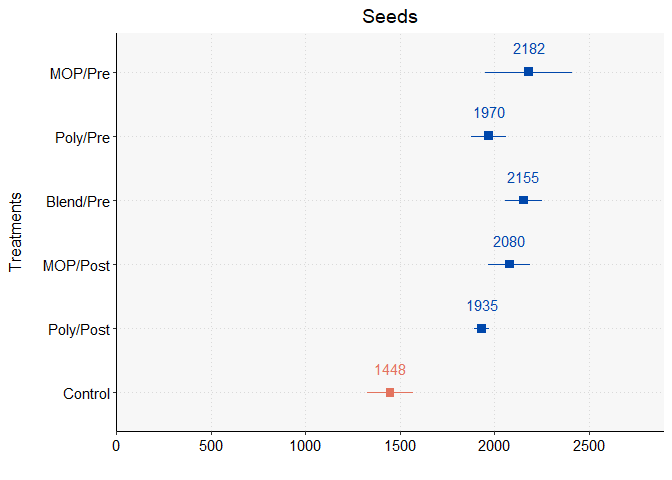<!-- -->

### 3.1.2. Fibra

``` r
# Gerando o gráfico para peso de fibras por hectare
graf_fib <- 
dados_graf %>% 
  ggplot(aes(x = Treat_novo, y = fiber_kgha, color = teste, fill = teste)) +
  stat_summary(fun.data = mean_se, size = 0.6, linewidth = 0.7, shape = 15) +
  stat_summary(fun = mean, geom = "text", aes(label = sprintf("%.f", after_stat((y)))), position = position_nudge(x = 0.38), family = "sans", size = 4) +
  xlab("") + labs(title = "Fiber") + ylab("") +
   coord_flip() +
  scale_y_continuous(breaks = seq(0, 2500, by = 500), limits = c(0, 2900), expand = c(0, 0)) +
  scale_color_manual(values = c("#0047AB", "#E3735E")) +
  theme_classic() + tema +
  theme(axis.text.y =element_blank(),
        axis.title.y = element_blank(),
        plot.title = element_text(hjust = 0.5))

# Observando o gráfico
graf_fib
```

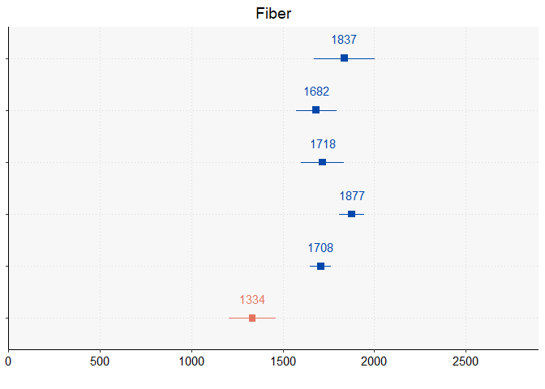<!-- -->

### 3.3.3. Juntando os gráficos

``` r
# Juntando as dois gráficos em um
graf_junto <- plot_grid(graf_sem, graf_fib, nrow = 1, ncol = 2, align = "v", rel_widths = c(1.06, 0.92), padding = 0.01)

# Criando um eixo x comum
titulo_x <- ggdraw() +
  draw_label(expression("Productivity (kg "~ha^-1*")"), size = 12, fontfamily = "sans", hjust = 0.3, vjust = -0.5)

# Juntando as partes
graf_produtividade <- plot_grid(graf_junto, titulo_x, nrow = 2, rel_heights = c(1, 0.075), align = "v", axis = "l")

# Verificando
graf_produtividade
```

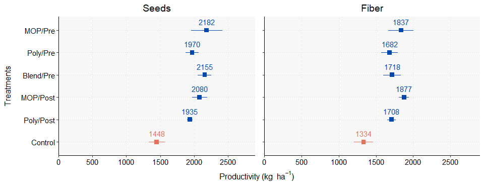<!-- -->

## 3.2. Gráficos de nutrientes foliares

### 3.2.1. N

``` r
# Gerando o gráfico para N foliar
graf_n <- 
dados_graf %>% 
  ggplot(aes(x = Treat_novo, y = N)) +
  stat_summary(fun.data = mean_se, size = 0.6, linewidth = 0.7, shape = 15, color = "#0047AB") +
  stat_summary(fun = mean, geom = "text", aes(label = sprintf("%.1f", after_stat((y)))), position = position_nudge(x = 0.38), family = "sans", color = "#0047AB", size = 4) +
  xlab("") + coord_flip() +
  ylab(expression("N foliar content (g "~kg^-1*")")) +
  scale_y_continuous(breaks = seq(0, 55, by = 10), limits = c(0, 55)) +
  theme_classic() + tema +
  theme(legend.position = "none")

# Observando o gráfico
graf_n
```

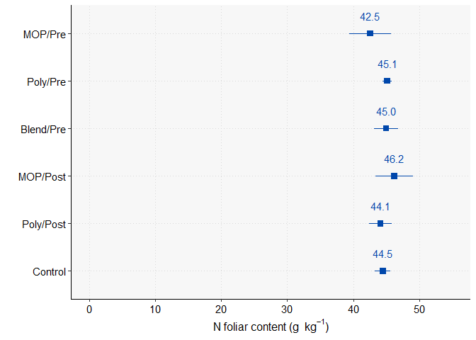<!-- -->

### 3.2.2. P

``` r
# Gerando o gráfico para P foliar
graf_p <- 
dados_graf %>% 
  ggplot(aes(x = Treat_novo, y = P)) +
  stat_summary(fun.data = mean_se, size = 0.6, linewidth = 0.7, shape = 15, color = "#0047AB") +
  stat_summary(fun = mean, geom = "text", aes(label = sprintf("%.2f", after_stat((y)))), position = position_nudge(x = 0.38), family = "sans", color = "#0047AB", size = 4) +
  xlab("") + coord_flip() +
  ylab(expression("P foliar content (g "~kg^-1*")")) +
  scale_y_continuous(breaks = seq(0, 6, by = 1), limits = c(0, 6)) +
  theme_classic() + tema +
  theme(legend.position = "none")

# Observando o gráfico
graf_p
```

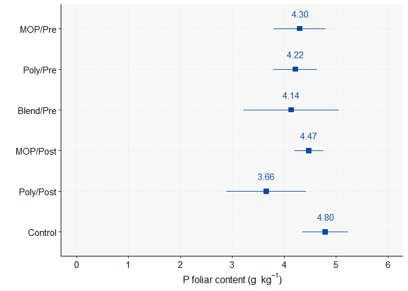<!-- -->

### 3.2.3. Ca

``` r
# Gerando o gráfico para Ca foliar
graf_ca <- 
dados_graf %>% 
  ggplot(aes(x = Treat_novo, y = Ca)) +
  stat_summary(fun.data = mean_se, size = 0.6, linewidth = 0.7, shape = 15, color = "#0047AB") +
  stat_summary(fun = mean, geom = "text", aes(label = sprintf("%.1f", after_stat((y)))), position = position_nudge(x = 0.38), family = "sans", color = "#0047AB", size = 4) +
  xlab("") + coord_flip() + 
  ylab(expression("Ca foliar content (g "~kg^-1*")")) +
  scale_y_continuous(breaks = seq(0, 45, by = 10), limits = c(0, 45)) +
  theme_classic() + tema +
  theme(legend.position = "none")

# Observando o gráfico
graf_ca
```

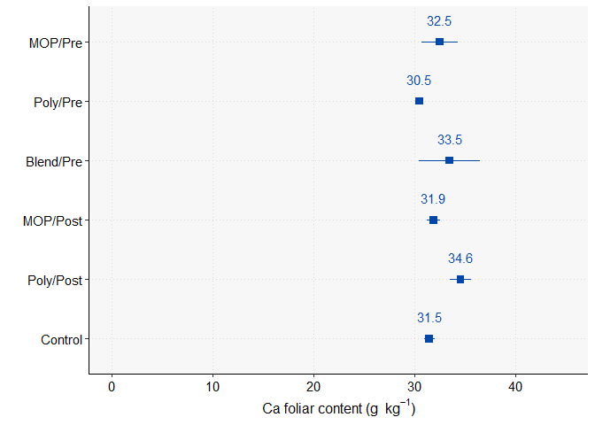<!-- -->

### 3.2.4. S

``` r
# Gerando o gráfico para peso de sementes por hectare
graf_s <- 
dados_graf %>% 
  ggplot(aes(x = Treat_novo, y = S, color = teste)) +
  stat_summary(fun.data = mean_se, size = 0.6, linewidth = 0.7, shape = 15) +
  stat_summary(fun = mean, geom = "text", aes(label = sprintf("%.2f", after_stat((y)))), position = position_nudge(x = 0.38), family = "sans", size = 4) + 
  xlab("") + coord_flip() +
  ylab(expression("S foliar content (g "~kg^-1*")")) +
  scale_y_continuous(breaks = seq(0, 3.5, by = 0.5), limits = c(0, 3.5)) +
  scale_color_manual(values = c("#0047AB", "#E3735E")) +
  theme_classic() + tema +
  theme(legend.position = "none")

# Observando o gráfico
graf_s
```

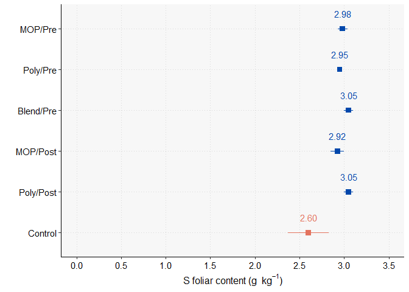<!-- -->

### 3.2.5. Mg

``` r
# Gerando o gráfico para peso de sementes por hectare
graf_mg <- 
dados_graf %>% 
  mutate(teste = case_when(
    Treat == 1 | Treat == 6 ~ "a",
    Treat == 2 | Treat == 3 | Treat == 4 | Treat == 5  ~ "b"
  )) %>% 
  ggplot(aes(x = Treat_novo, y = Mg, color = teste, fill = teste)) +
  stat_summary(fun.data = mean_se, size = 0.6, linewidth = 0.7, shape = 15) +
  stat_summary(fun = mean, geom = "text", aes(label = sprintf("%.2f", after_stat((y)))), position = position_nudge(x = 0.38), family = "sans", size = 4) +
  xlab("") + coord_flip() +
  ylab(expression("Mg foliar content (g "~kg^-1*")")) +
  scale_y_continuous(breaks = seq(0, 12, by = 3), limits = c(0, 12)) +
  scale_color_manual(values = c("#0047AB", "#E3735E")) +
  theme_classic() + tema +
  theme(legend.position = "none")

# Observando o gráfico
graf_mg
```

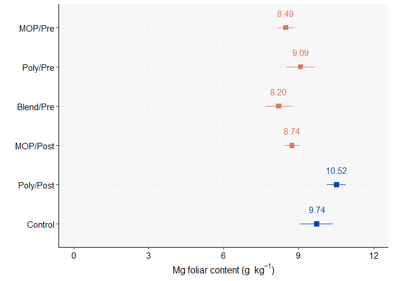<!-- -->

### 3.2.6. K

``` r
# Gerando o gráfico para peso de sementes por hectare
graf_k <- 
dados_graf %>% 
  mutate(teste = case_when(
    Treat == 1 ~ "c",
    Treat == 2 | Treat == 3 | Treat == 4 | Treat == 5 ~ "b",
    Treat == 6 ~ "a")) %>% 
  ggplot(aes(x = Treat_novo, y = K, color = teste, fill = teste)) +
  stat_summary(fun.data = mean_se, size = 0.6, linewidth = 0.7, shape = 15) +
  stat_summary(fun = mean, geom = "text", aes(label = sprintf("%.1f", after_stat((y)))), position = position_nudge(x = 0.38), family = "sans", size = 4) +
  xlab("") + coord_flip() +
  ylab(expression("K foliar content (g "~kg^-1*")")) +
  scale_y_continuous(breaks = seq(0, 24, by = 4), limits = c(0, 25)) +
  scale_color_manual(values = c("#0047AB", "#009E73", "#E3735E")) +
  theme_classic() + tema +
  theme(legend.position = "none")

# Observando o gráfico
graf_k
```

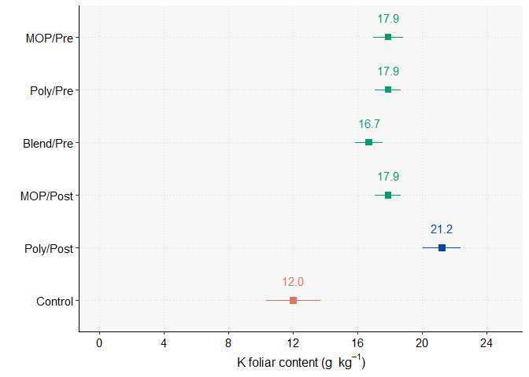<!-- -->

### 3.2.7. Juntando os gráficos

``` r
# Juntando as dois gráficos em um
graf_junto2 <- plot_grid(graf_n, graf_p, graf_k, graf_ca, graf_mg, graf_s, nrow = 3, ncol = 2, align = "v")

# Criando um eixo comum
titulo_x2 <- ggdraw() +
  draw_label("Treatments", size = 12, fontfamily = "sans", angle = 90)

# Juntando as parte
graf_nutrientes <- plot_grid(titulo_x2, graf_junto2, nrow = 1, ncols = 2, rel_widths = c(0.075, 3))

# Visualizando
graf_nutrientes
```

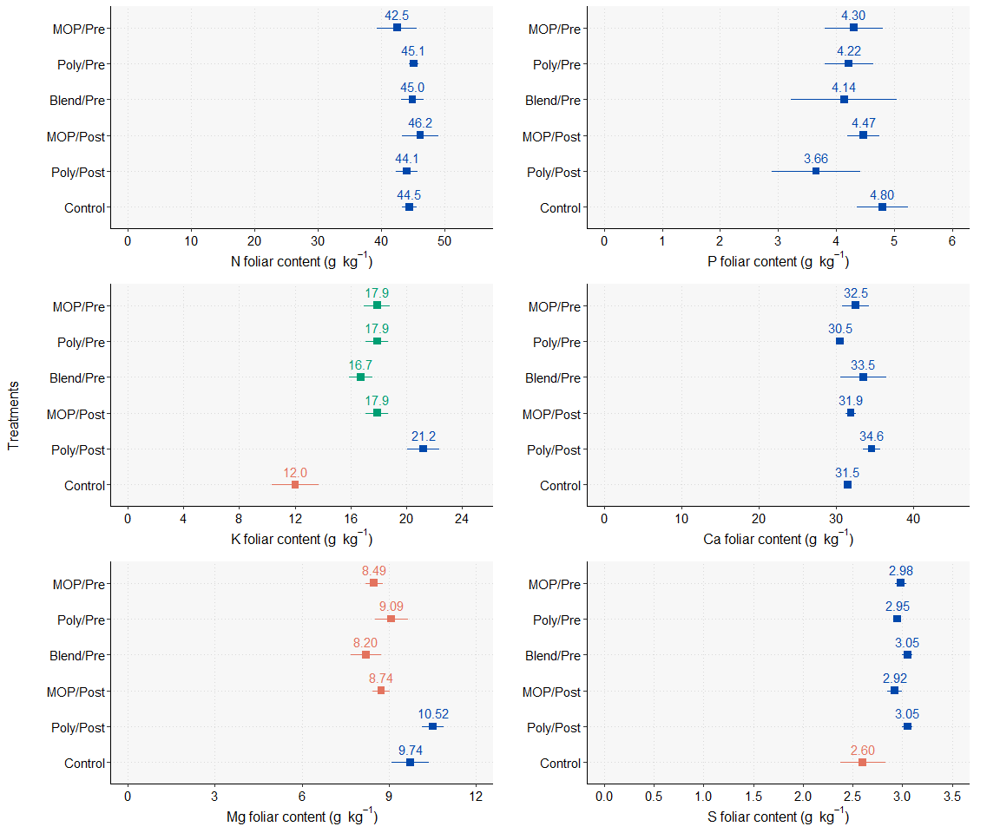<!-- -->

## 3.3. Versão para apresentação

``` r
# Juntando as dois gráficos em um
reg_tt <- plot_grid(graf_sem, graf_fib, nrow = 1, ncol = 2, align = "v", rel_widths = c(1.06, 0.92), padding = 0.01)

# Criando um eixo x comum
x_axis_label <- ggdraw() +
  draw_label(expression("Productivity (kg "~ha^-1*")"), size = 12, fontfamily = "serif", hjust = 0.3, vjust = -0.5)

# Criando um título
titulo <- ggdraw() +
  draw_label("Cotton seeds and fiber productivity", size = 16, fontface = "bold", fontfamily = "serif", hjust = 0.5, vjust = -1.4) +
  draw_label("Different K fertilization treatments were evaluated, with all fertilized treatments showing comparable results in terms of productivity. \n In contrast, the control treatment without K fertilization exhibited significantly lower yields. \n The findings suggest that K fertilization is critical for maximizing cotton productivity, and polyhalite may serve as a viable alternative to KCl.", size = 11, fontfamily = "serif", hjust = 0.5, vjust = 0.8)

# Criando um rodapé
rodape <- ggdraw() +
  draw_label("Means and error bars, identified by different colors, differ according to the Scott-Knott test (p < 0.10). Regarding the treatments: \n MOP - muriate of potash (KCl), Poly - polyhalite, Pre - fertilizer application in the plant furrow, Post - fertilizer application on the soil surface 40 days after germination.", size = 9.5, fontface = "italic", fontfamily = "serif", vjust = 0, hjust = 0.5)

# Juntando as partes
teste <- plot_grid(titulo, reg_tt, x_axis_label, rodape, nrow = 4, rel_heights = c(0.3 ,1, 0.075, 0.05))

teste
```

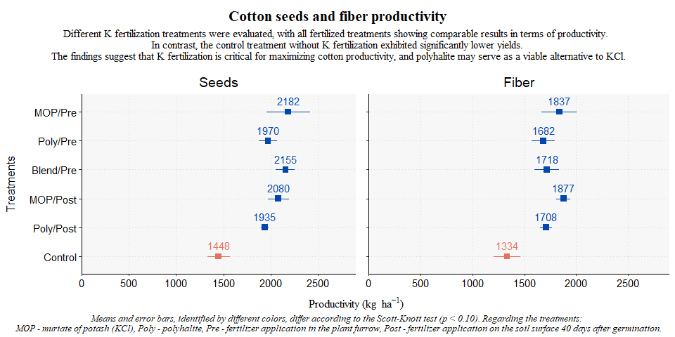<!-- -->
